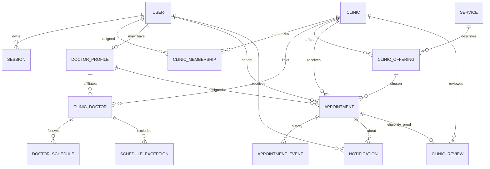

# Minimum MVP Database Design — Hippocrates.am

> **CONCEPTUAL SCHEMA, NOT IMPLEMENTED MIGRATIONS.** 2026-09-29. Apply only the 23 `BRIEF.md` features. No EHR/chat/Q&A/advanced finance tables or fake future clinical relations.

## Authoritative data groups

| Domain | Minimum entity | Main responsibility / representative fields |
| --- | --- | --- |
| Identity | `User` | Opaque ID, display name, approved contact/login fields, account state |
| Identity | `Session` | Hashed opaque session ID, user, expiry/revocation, activity policy |
| Clinics | `Clinic` | Public name, description, single MVP location/contact, draft/published state |
| Clinics | `ClinicMembership` | User, clinic, role (admin); active/revoked state and timestamps |
| Verification | `VerificationCase` | **Separate target type** CLINIC or DOCTOR, reviewer, status and audit; protected evidence refs if approved |
| Doctors | `DoctorProfile` | Linked user or approved identity, specialization, public professional fields, verification/publication |
| Doctors | `ClinicDoctor` | Active clinic-doctor assignment; one active clinic/doctor default requires owner sign-off |
| Catalog | `Service` | Minimal approved service identity/name/category as needed |
| Catalog | `ClinicOffering` | Clinic, approved doctor/service eligibility if needed, published price/currency and optional estimate flag |
| Scheduling | `DoctorSchedule` | Doctor+clinic, weekday/date and time intervals, clinic time zone |
| Scheduling | `ScheduleException` | Basic unavailable intervals/holidays (not room/equipment management) |
| Appointments | `Appointment` | Patient, doctor, clinic, offering, UTC start/end, status, agreed offering/price snapshot if shown |
| Appointments | `AppointmentEvent` | Controlled transition history, actor, timestamp, sanitized reason |
| Appointments | `AppointmentIdempotency` | Actor, request key/fingerprint, operation outcome for safe retries |
| Notifications | `Notification` | Recipient, appointment event, minimal content, read state; optional delivery status if email approved |
| Reviews | `ClinicReview` | Patient, appointment, clinic, rating/text, native/published/moderation state |
| Audit | `AuditEvent` | Restricted clinic/doctor approvals, permissions and booking actions with sanitized metadata |

Store only necessary patient contact information for booking. Clinical diagnosis, visit notes, imaging, payment details, private messaging and anonymous-public-Q&A author data **must not** be added by the minimum schema.

## Conceptual relationships

The diagram is conceptual; actual column names/types/keys require approved migrations and schema review.

## Access and publication constraints

- Every clinic-owned operational row has a trustworthy clinic scope or a constrained FK path to one. Composite integrity and service checks block Clinic A references to Clinic B private objects.
- `Clinic` and `DoctorProfile` publication are distinct; public clinic and doctor projections require independently approved verification states where applicable.
- Clinic membership revocation is checked **on each protected request**; a stale signed-in session does not preserve revoked clinic powers.
- Proposed minimum MVP permits **one active** `ClinicDoctor` per doctor globally (partial unique index on active link), pending explicit owner approval. Never publish a second active link without extended scheduling rules.
- Patient may have appointments with several clinics but sees only their own records; each clinic sees only its own permitted booking details.

## Appointment state and conflict integrity

**Proposed appointment states:** `REQUESTED`, `CONFIRMED`, `CANCELLED`, `COMPLETED`. Both `REQUESTED` and `CONFIRMED` occupy doctor time. Only the clinic can move `REQUESTED -> CONFIRMED` and permitted clinic user can move `CONFIRMED -> COMPLETED` after actual visit; cancellation is a controlled separate action with owner-approved cutoffs. A completed visit is an **operational** status only.

**Required invariant:** one doctor may have **at most one overlapping active appointment** for a given interval. Option A: PostgreSQL range/exclusion constraint on doctor ID and `[start,end)` with partial active-status predicate. Combine with ordered transaction locking as appropriate, or a proved alternative with a database-backed concurrency test. If Prisma lacks direct support for the chosen constraint, use an explicitly reviewed SQL migration.

Appointment creation transaction:

1. Authorize patient; validate clinic, approved doctor, active clinic assignment, published eligible offering, schedule/unavailability and UTC range.
2. Authoritatively reject conflicting active occupancy in a serializable/constraint-protected transaction; enforce idempotency key/payload fingerprint.
3. Create `REQUESTED` appointment and append minimal `AppointmentEvent`; persist basic in-app `Notification` and/or a conditional outbox delivery intent in the same transaction.
4. Return safe conflict `409` without revealing another patient's/clinic's appointment details.

Cancellation transaction validates actor, policy, status, and updates appointment to `CANCELLED`, releases occupancy and appends event atomically. Retain the historical appointment. Never trust cached availability as reservation proof.

## Clinic review and ratings integrity

- Reviews refer to **own patient's** `COMPLETED` platform appointment and the appointment's clinic; one clinic review per eligible appointment (unique appointment target association).
- Rating range and allowed content policy require owner approval; validate server-side.
- Public rating may derive from published valid native clinic reviews; expose rating **and count**. Native data must not be blended with unverified external sources.
- Review author/contact/underlying booking remain restricted; public DTO may show only approved display name or pseudonym per privacy rules.

## Basic indexes and migrations

- Published clinic/doctor lookup by status/name/specialty; foreign keys for clinic offerings and doctor assignments.
- Clinic/day, doctor/time and patient/time indexes for booking and portal lists.
- Unique active doctor-clinic link (subject to scope approval); overlap exclusion and idempotency unique key.
- Unique completed appointment review proof per clinic review; authorized booking events and minimal audit indexes.
- Create tables from reviewed, versioned migrations only; verify `CHECK` constraints, exclusion indexes, rollback strategy and query plans in staging.
- Development/staging use synthetic fixtures; define backup encryption, region, retention and a **tested restore** before first real appointment.

## Minimal schema exclusions

No `Conversation`, `Message`, `PublicQuestion`, `PrivateQuestionAuthor`, `PublicAnswer`, `ReviewReply`, `Resource` room/chair/device booking, multi-branch `Branch` operations, doctor cross-clinic concurrent schedule support, `TreatmentPlan`, `MedicalNote`, `ClinicalEncounter`, imaging/CT study, invoice, deposit or payment tables in this MVP. A future scope/ADR may add them later.

**Still open:** production data residency and the file-storage vendor. Accepted: email login, 12-hour sessions, one active clinic per doctor, clinic-confirmed booking, in-app notices, private verification evidence, and the rating sort in `DECISIONS.md`. `BRIEF.md` is product authority.
