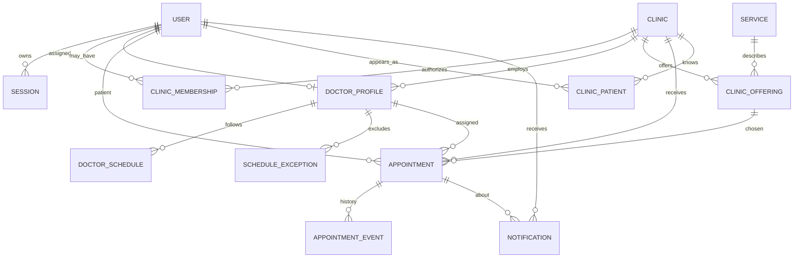

# Minimum MVP Database Design — Hippocrates.am

> **CONCEPTUAL SCHEMA, NOT IMPLEMENTED MIGRATIONS.** Revised 2026-09-30. No review tables. A doctor profile has one clinic. No EHR and no payment tables. Financial totals are queries over appointment prices.

## Authoritative data groups

| Domain | Minimum entity | Main responsibility / representative fields |
| --- | --- | --- |
| Identity | `User` | Opaque ID, display name, approved contact/login fields, account state |
| Identity | `Session` | Hashed opaque session ID, user, expiry/revocation, activity policy |
| Clinics | `Clinic` | Public name, description, single MVP location/contact, draft/published state |
| Clinics | `ClinicMembership` | User, clinic, role (admin); active/revoked state and timestamps |
| Verification | `VerificationCase` | **Separate target type** CLINIC or DOCTOR, reviewer, status and audit; protected evidence refs if approved |
| Doctors | `DoctorProfile` | One user, exactly one clinic, specialization, public fields, verification. A second clinic is a second user |
| Catalog | `Service` | Minimal approved service identity/name/category as needed |
| Catalog | `ClinicOffering` | Clinic, approved doctor/service eligibility if needed, published price/currency and optional estimate flag |
| Scheduling | `DoctorSchedule` | Doctor+clinic, weekday/date and time intervals, clinic time zone |
| Scheduling | `ScheduleException` | Basic unavailable intervals/holidays (not room/equipment management) |
| Appointments | `Appointment` | Patient, doctor, clinic, offering, UTC start/end, status, agreed offering/price snapshot if shown |
| Appointments | `AppointmentEvent` | Controlled transition history, actor, timestamp, sanitized reason |
| Appointments | `AppointmentIdempotency` | Actor, request key/fingerprint, operation outcome for safe retries |
| Notifications | `Notification` | Recipient, appointment event, minimal content, read state; optional delivery status if email approved |
| Patients | `ClinicPatient` | Clinic, patient user, contact needed by that clinic. Created from this clinic's appointments. No clinical note |
| Audit | `AuditEvent` | Restricted clinic/doctor approvals, permissions and booking actions with sanitized metadata |

Store only necessary patient contact information for booking. Clinical diagnosis, visit notes, imaging, payment details, private messaging and anonymous-public-Q&A author data **must not** be added by the minimum schema.

## Conceptual relationships

The diagram is conceptual; actual column names/types/keys require approved migrations and schema review.

## Access and publication constraints

- Every clinic-owned operational row has a trustworthy clinic scope or a constrained FK path to one. Composite integrity and service checks block Clinic A references to Clinic B private objects.
- `Clinic` and `DoctorProfile` publication are distinct; public clinic and doctor projections require independently approved verification states where applicable.
- Clinic membership revocation is checked **on each protected request**; a stale signed-in session does not preserve revoked clinic powers.
- `DoctorProfile.clinicId` is required. The doctor user cannot have a membership or profile at a second clinic. Enforce this with a unique doctor user and a check that rejects a second clinic.
- Patient may have appointments with several clinics but sees only their own records; each clinic sees only its own permitted booking details.

## Appointment state and conflict integrity

**Appointment states:** `REQUESTED`, `CONFIRMED`, `CANCELLED`, `COMPLETED`. `REQUESTED` and `CONFIRMED` occupy that doctor account's time. There is no cancellation cutoff and no automatic expiry. `COMPLETED` means the person attended. It is not a review and not a medical note.

**Required invariant:** one doctor may have **at most one overlapping active appointment** for a given interval. Option A: PostgreSQL range/exclusion constraint on doctor ID and `[start,end)` with partial active-status predicate. Combine with ordered transaction locking as appropriate, or a proved alternative with a database-backed concurrency test. If Prisma lacks direct support for the chosen constraint, use an explicitly reviewed SQL migration.

Appointment creation transaction:

1. Authorize patient; validate clinic, approved doctor, active clinic assignment, published eligible offering, schedule/unavailability and UTC range.
2. Authoritatively reject conflicting active occupancy in a serializable/constraint-protected transaction; enforce idempotency key/payload fingerprint.
3. Create `REQUESTED` appointment and append minimal `AppointmentEvent`; persist basic in-app `Notification` and/or a conditional outbox delivery intent in the same transaction.
4. Return safe conflict `409` without revealing another patient's/clinic's appointment details.

Cancellation transaction validates actor, policy, status, and updates appointment to `CANCELLED`, releases occupancy and appends event atomically. Retain the historical appointment. Never trust cached availability as reservation proof.

## Patients and totals

- `ClinicPatient` exists only for a patient who has an appointment at that clinic. It stores contact for that clinic, not a diagnosis.
- Financial analysis reads fixed `Appointment` price snapshots for one clinic, grouped into `REQUESTED`, `CONFIRMED`, and `COMPLETED`. `CANCELLED` adds nothing. Estimated prices are excluded from the money total. Do not add an invoice or payment table.

## Basic indexes and migrations

- Published clinic/doctor lookup by status/name/specialty; foreign keys for clinic offerings and doctor assignments.
- Clinic/day, doctor/time and patient/time indexes for booking and portal lists.
- Unique doctor user. Overlap exclusion and idempotency unique key.
- Clinic plus patient unique on `ClinicPatient`. Authorized booking events and minimal audit indexes. No review index.
- Create tables from reviewed, versioned migrations only; verify `CHECK` constraints, exclusion indexes, rollback strategy and query plans in staging.
- Development/staging use synthetic fixtures; define backup encryption, region, retention and a **tested restore** before first real appointment.

## Minimal schema exclusions

No `Conversation`, `Message`, `PublicQuestion`, `ClinicReview`, `ReviewReply`, room booking, multi-branch operations, a doctor user with two clinics, `TreatmentPlan`, `MedicalNote`, imaging, invoice, deposit, or payment tables. Booking-price totals are queries, not a ledger.

**Still open:** production data residency and the file-storage vendor. Accepted: email login, 12-hour sessions, one doctor account per clinic, clinic-confirmed booking, in-app notices, private verification evidence, no reviews, and `MVP-24` through `MVP-27`. `BRIEF.md` is product authority.
