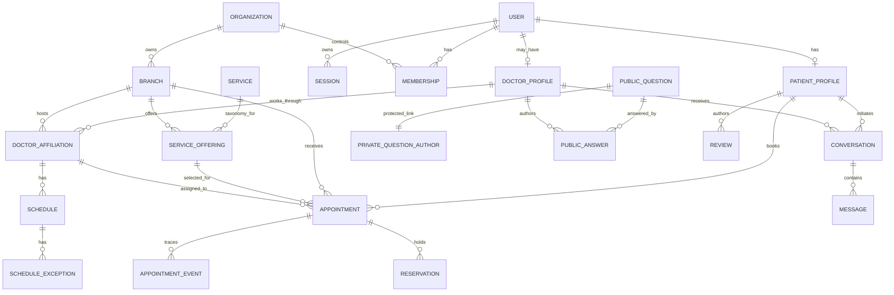

# Database Design: Hippocrates.am (V1)

> **Conceptual schema proposal; no production migrations or live data changes.** Use this document to prepare a reviewed executable schema only after V1 product scope, architecture and TECH_CARD approval.

**Version:** 1.0-draft  
**Target:** Version 1  
**Date:** 2026-09-28  
**Status:** PROPOSED

---

## 1. Design goals

- One unified patient/account identity, with isolated operational records for each participating clinic.
- One independent practitioner profile with multiple clinic affiliations and **one cross-clinic occupied-time constraint**.
- Strict separation of the public anonymous Q&A body from protected author mapping and separate private chat data.
- Transaction-safe booking, rescheduling, cancellation and history; availability searches remain non-authoritative.
- Native verified-visit review eligibility without revealing clinic-private details to other tenants.
- Minimal complexity: one PostgreSQL primary proposed; no default Redis, microservices, clinical EHR/PACS tables or specialized search infrastructure.

## 2. Entity ownership and representative fields

All attributes are **candidates**, not an executable schema. Exact nullability, enums, indices and column names require review.

| Owner | Entity | Essential relationships / fields |
| --- | --- | --- |
| Identity | `User` | Platform identity, safe account status, own profile associations. |
| Identity | `Session` | Opaque **hashed token reference**, `userId`, created/idle/absolute expiry, revokedAt; no plaintext bearer secret in DB. |
| Identity | `PatientProfile` | `userId`, minimal contact/preferences (avoid collecting diagnoses in V1). |
| Organizations | `Organization` | `id`, type (V1 dental/maxillofacial), onboarding and publication state. |
| Organizations | `Branch` | `id`, `organizationId`, address, IANA time zone, operating hours. |
| Organizations | `Membership` | `userId`, `organizationId`, allowed branch scope, role/permissions, active/revoked state. |
| Organizations | `VerificationCase` | Separate organization/doctor target and protected status/evidence reference; audit decisions. |
| Practitioners | `DoctorProfile` | Independent `userId`, public approved biography, specialties, credentials/verification status. |
| Practitioners | `DoctorAffiliation` | `doctorId`, `organizationId`, `branchId`, active status; doctor may have several. |
| Catalog | `Service` | Canonical name/category and public description (not clinic price). |
| Catalog | `ServiceOffering` | `serviceId`, `organizationId`, `branchId`, published duration and preliminary price/status. |
| Scheduling | `Schedule` | `doctorAffiliationId`, recurring working hours, exceptions separately. |
| Scheduling | `ScheduleException` | Absence/break/special working time for approved association/resource. |
| Scheduling | `Resource` | Branch room/chair/device identity; correctly scoped organization/branch. |
| Scheduling | `SlotHold` | Patient, intended offering/branch/doctor/time, expiry, holder nonce/version; transient logical hold persisted when needed. |
| Scheduling | `Reservation` | Canonical reservable actor (doctor or branch resource), time range, appointment/hold reference and active lifecycle. |
| Appointments | `Appointment` | `patientId`, `organizationId`, `branchId`, selected doctor affiliation (nullable only if approved offering supports it), `serviceOfferingId`, start/end, state, offering/price snapshot. |
| Appointments | `AppointmentEvent` | Append-only actor, timestamp, old/new state, allowed metadata, no clinical notes. |
| Messaging | `Conversation` | Patient, doctor, requested/active/closed/blocked status and policy flags. |
| Messaging | `Message` | Conversation, author participant, text, createdAt, moderation report references under restricted policy. |
| Public Q&A | `PublicQuestion` | Published-safe question text/title/category, publication/moderation state; **no public author field**. |
| Public Q&A | `PrivateQuestionAuthor` | Private link between question and submitting `userId`; inaccessible to public/doctor queries. |
| Public Q&A | `PublicAnswer` | Verified doctor, question, moderated text, state and publication date. |
| Reviews | `Review` | Patient-protected review author, target doctor/clinic, source `NATIVE`, eligibility proof reference, moderation state, criterion ratings. |
| Reviews | `ReviewReply` | Relevant doctor/clinic member, text, moderation state. |
| Moderation | `ModerationCase` | Type/target, decision history, minimal evidence and restricted authorized access. |
| Notifications | `NotificationIntent` | Internal recipient reference, template ID, minimal event data, due time and retry/delivery state. |
| Foundation | `AuditEvent` | Actor, action, target, scope, timestamp, sanitized before/after or references; protected append-only audit. |
| Foundation | `OutboxEvent` | Transactional event ID/type/version, scrubbed payload, delivery metadata, retry status if reliable async used. |

Identity vs patient vs doctor vs clinic membership are **not interchangeable**. A public `Review` may use pseudonymous presentation even when platform verification holds a protected author link. External review storage is not part of V1 by default.

## 3. Conceptual relationship diagram

This diagram omits some FK links for readability. Actual database constraints and authorized queries must not depend on the diagram alone.

## 4. Tenant isolation and cross-clinic practitioner time

**Tenant rule:** operational records for a clinic carry or securely derive `organizationId` and, where needed, `branchId`. Composite foreign keys and scoped queries should prevent a record in clinic A referencing clinic B's private offering, branch or appointment. Active membership is checked at request time. Optional PostgreSQL RLS is a defense-in-depth decision only after safe context and pooling design approval.

**Doctor rule:** canonical practitioner identity is global; a doctor may be affiliated with clinics A and B. Their global time reservation must use a common practitioner reservation key (e.g., internal canonical resource identity). Another clinic can learn only **busy/free**, never the other organization's patient or booking details. This does not guarantee conflict-free scheduling with **external** calendars absent approved integration.

**Public projection rule:** published organization/doctor pages, prices, review and Q&A projections must be produced through allowlisted read models rather than sharing whole ORM records or nested private relations. User/clinic private data must not enter cache keys or rendered static pages with incorrect scope.

## 5. Booking concurrency and states — mandatory design gate

**Conceptual states:** `SlotHold=ACTIVE|EXPIRED|CONSUMED|CANCELLED`; `Appointment=REQUESTED|CONFIRMED|CHECKED_IN|IN_PROGRESS|COMPLETED|CANCELLED|NO_SHOW`; exact transitions and deadlines remain pending product approval. Do not add generic update-status operations that bypass the owner module.

**Atomic confirmation outline:**

1. Authorize patient or appropriately scoped receptionist; validate approved offering/branch/practitioner/resource rules.
2. Lock the relevant canonical doctor/resource occupancy keys (transaction lock/advisory lock/constraint strategy must be reviewed for deadlocks and horizontal concurrency).
3. Re-evaluate hold expiry, exact interval overlaps, schedule exceptions, existing confirmed reservations and concurrent active holds **within** the authoritative transaction.
4. Create Appointment and all active reservations, consume/release the temporary hold as applicable, append AppointmentEvent and optional minimal notification outbox intent, then commit as a single unit.
5. On conflict, roll back cleanly and return a neutral `409` unavailable result without revealing another clinic's booking details. Use request idempotency to avoid duplicate appointments on retries.

**Database enforcement:** prefer PostgreSQL range/exclusion constraints for active confirmed reservations where practical, combined with appropriately serialized transactions for temporary **expiring** holds; an SQL exclusion constraint does not automatically release expired holds just because wall-clock time advances. If Prisma cannot express a chosen constraint, create and review a raw SQL migration. Lock multiple resources in a deterministic order. Simulate concurrent holds, confirmations, cancellations, reschedules and worker retries against a real test PostgreSQL database.

**Reschedule:** atomically reserve the new interval, release old reservations, preserve previous time in append-only events and notify only after commit. Completed/No-show visits stay in history and do not reopen the previous slot retroactively.

## 6. Indexes and integrity — conceptual

- Unique normalized account login identity according to the eventually approved credential flow; protect mutable identity updates.
- Active membership uniqueness on appropriate `(userId, organizationId, role/scope)` model; avoid storing contradictory duplicated role fields.
- Unique doctor affiliation `(doctorId, branchId)` if product semantics allow only one active affiliation per branch; preserve inactive history.
- Unique canonical service definitions as determined by approved taxonomy; published offering uniqueness only when the product specifies it.
- Fast public indexes for published clinic/doctor and filterable offerings; use PostgreSQL text search first, without pre-approving a specialist engine.
- Scheduling interval constraints by canonical reservable key; indexes for branch-day and patient/doctor schedule reads.
- Append-only event/audit keys, idempotency keys and notification retry/due-time indexes.
- Separate restricted indexes on `PrivateQuestionAuthor.questionId`, never expose author mapping in public read projections.
- Referential checks ensure Review verification does not claim another patient's or clinic's unrelated appointment; avoid public raw appointment IDs where unnecessary.

**Retention:** set and approve separate rules for account data, booking organizational history, chat text, anonymous-question private mappings, moderation evidence, verification documents, audit logs and backups. Do not invent legally binding retention periods. V1 does not store clinical diagnoses or imaging data.

## 7. Migration and data protection

- One versioned migration owner for each release; migration privileges separated from API/worker runtime roles.
- Staging validates migration/rollback, constraints, index locks and concurrent readers before production changes.
- Support expand/deploy/backfill/contract when mixed application versions are possible.
- Synthetic-only development test data; **do not copy live patient/private chat/identity evidence into development by default**.
- Encrypted connections and suitable at-rest controls; least-privilege DB roles and secret management.
- Provider/region/backup retention, RPO/RTO, encryption-key practices and tested restore require TECH_CARD and security approval.

## 8. Acceptance tests before real patient launch

- A doctor affiliated to two clinics cannot confirm overlapping Hippocrates appointments; the losing concurrent request receives safe conflict response.
- A receptionist for clinic A cannot read or mutate clinic B's appointments, patient contacts, staff or verification documents.
- Removing an employee's clinic membership revokes later clinic A access without removing separately authorized clinic B access.
- Public and verified-doctor Q&A projections do not expose `PrivateQuestionAuthor` through normal, error, metadata or search output.
- A private chat request from a doctor profile succeeds according to policy without an appointment; this grants **no** clinical-record permissions.
- Reviews marked visit-verified require a legitimate completed-visit basis and cannot be forged with another patient's appointment ID.
- Notification failure does not roll back a confirmed booking; duplicate job processing does not send uncontrolled duplicate messages.
- Migration rehearsal, backups and restore succeed; no real secrets or private patient content are emitted to logs.

**Related:** `BRIEF.md` (after approval), `ARCHITECTURE_TEMPLATE.md`, `02-TECH_STACK.md`, `04-API.md`, `TECH_CARD.md`, `DECISIONS.md`.
